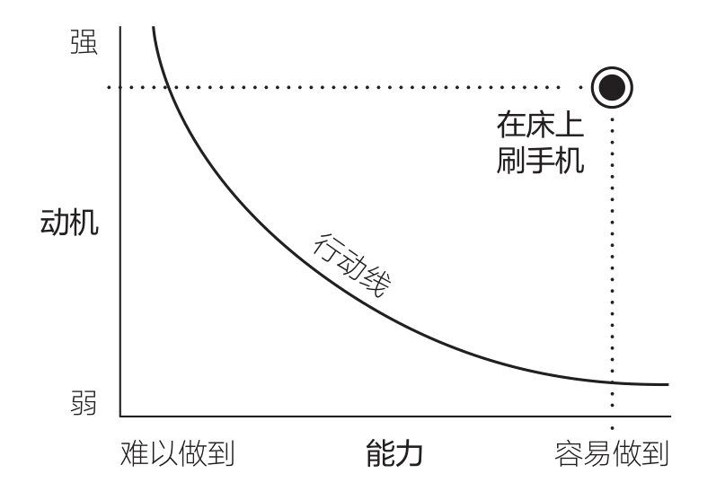

# 影响行为的三要素

## 三要素

- 福格行为模型模型具有普适性，一个行为在三要素齐全的时候才会发生，无论是好是坏。

## 对我们行为设计的启发

>MAP是行动发生的三要素，ABC是针对要素的具体实施方法，ABC是与MAP一一对应的。一个完整的行为设计流程应该是A→B→C，提示、行为发生、奖励、缺一不可。提示是一次行为的触发条件，也是为下一次行为的发生创造条件。提所以在自己设计的时候，分这样的三栏来编写。

## 动机-能力曲线

- 以动机为纵轴，能力为横轴建立坐标系，在第一象限中有一条反函数曲线。两者乘积越大，愿望就强烈。

- 重复行动，使之成为一种习惯。

- 对于四个动机-能力曲线的分析

  >凯蒂的例子中，“整理办公桌”和“在床上刷手机”两个行为一好一坏（用主流价值观下的评判），但都是遵循同样的机理。

>动机是波动的，但如果做更多简单的事情，行为发生的概率就更高。

<!-- ## 减肥

以减肥为例，对应行动三要素如下：

动机：
能力：
提示：

减肥的关键在于：管住嘴，迈开腿。

为了管住嘴，很多人选择去学习减肥餐的制作方法。而减肥餐最重要的就是：好吃，让你容易坚持下去。迈开腿的诀窍也是：从运动中感受到快乐，从而让你可以坚持下去。

所以减肥的本质在于：找到一套适合自己的健康生活方式。

不是一点高热量的食物都不能吃，偶尔的奖励是可以的。只是要控制高热量食物的量，把 -->

