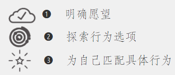

# 动机：寻找达成愿望的黄金行为

## 明明拥有动机却无法改变的5个原因

- 动机很复杂

- 动机冲上顶峰后会迅速回落

- 动机波动十分频繁

- 将动机用于追逐抽象概念无法产生结果

- 仅凭动机无法实现长期目标

## 行为匹配的3个误区：猜测

-  全凭猜测，毫无章法

>偶然性:❓堵车和自行车如何通过行为设计抉择？

-  从网上找灵感

>1. 不切实际的期待
>
>2. 不切实际的信息来源

-  照搬朋友的成功经验

>个体差异

## 摆脱猜测

<!-- ## 焦点地图

- 第一回合
  
>

- 第二回合

>

- 第三回合 

>

## 黄金行为-->

