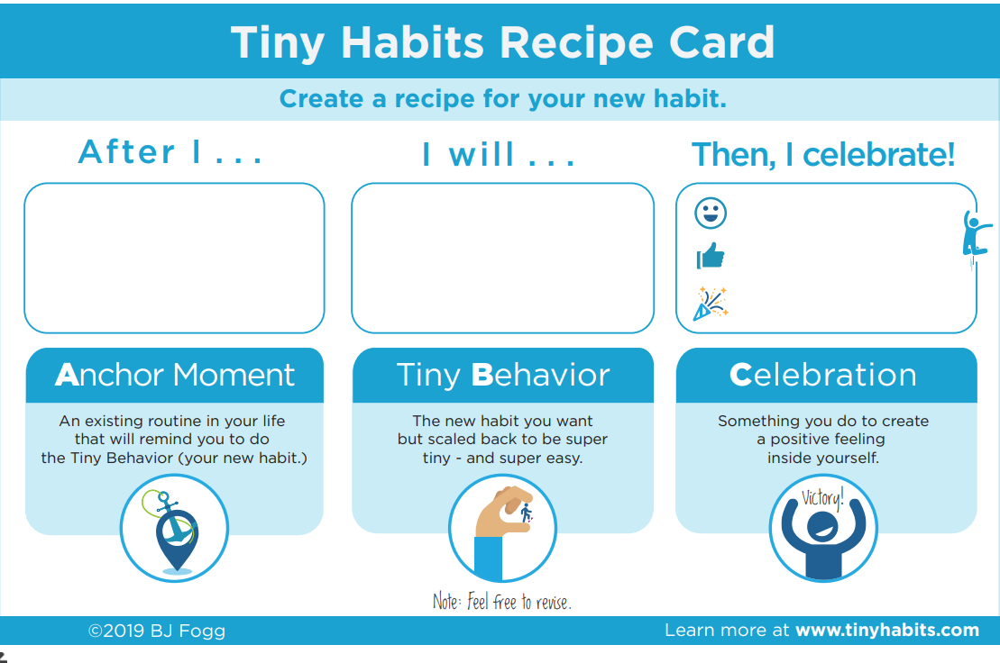

# 微习惯分享

## 每日

每天一起床→完成毛伊习惯(今天又是美好的一天)→刷学习强国视频（看积分变化）→洗漱（对着镜子微笑一下）

吃完早饭→洗碗（盯着白瓷碗欣赏一下精美的瓷质质感）→看《FBM》（群内打卡）

晚上刷牙后→使用牙线清洁一颗牙（）

## 重复

拿手机→喝水（回忆还差几瓶水，对进度的变化给予正反馈）

吃饭→洗碗

## 工作日

进入家门→洗衣服

## 自我精进

微信提示→背单词→城邦打卡

微信提示→电子书/参与活动→城邦打卡

## 微习惯设计卡片

